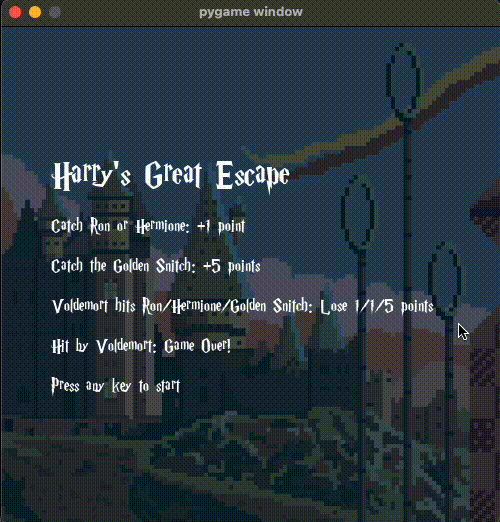

# Harry's Great Escape 🧙🏻
### Ivan Reyes | ACS 1111: Object Oriented Programming | Dani Roxberry 

---

### Demo

---

### ℹ️ Program Description
_Harry's Great Escape_ is interactive Pygame application inspired by the Harry Potter universe.  Navigate Harry through the magical corridors of Hogwarts, collecting points by catching his friends Ron and Hermione while dodging 'He-Who-Must-Not-Be-Named' (a.k.a. Voldemort). Bonus points if you catch the speedy Golden Snitch!

**Key features:**
* **Harry Potter Theme:** Uses custom graphics, sound effects, and a Harry Potter-based font.
* **Dynamic gameplay:**  Control Harry's movement with the arrow keys to navigate lanes and collect points.
* **Multiple game objects:**  Encounter Ron, Hermione, the Golden Snitch, and Voldemort, each with its own behavior and point value.
* **Animated background:**  Enjoy a lively backdrop with floating magical objects.
* **Sound effects:**  Experience immersive audio feedback with sound effects for catching characters and game over events.
* **Background music:**  Enjoy a continuous soundtrack that enhances the gameplay.
* **Scorekeeping:**  Track your progress with a dynamic scoring system at the top left of the screen.
* **Ready screen:**  Start with a visually appealing screen displaying the game title and rules.
* **Game over reset:**  Restart the game automatically when Harry collides with Voldemort.
* **Modular code:**  Organized code structure with separate files for game objects and constants for better readability and maintainability.

---

### ❗️ How To Use
1. **Clone the repository:**
- **HTTPS**: `git clone https://github.com/lawrence-ivan-reyes/pygame-tutorial.git`  
- **SSH**: `git clone git@github.com:lawrence-ivan-reyes/pygame-tutorial.git`  
- **GitHub CLI**: `gh repo clone lawrence-ivan-reyes/pygame-tutorial` 

2. **Install Pygame:**
`pip3 install pygame`

3. **Run the Program:**
`python3 main.py`

4. **Game Controls:**
- **Arrow keys:** Move Harry up, down, left, or right.
- **Esc key:** Quit the game.

---

### 💻 Code Structure
**Main Game Files**
- `main.py`: The main game file that initializes Pygame, sets up the game, and runs the game loop.
- `constants.py`: Stores game constants like screen dimensions and lane positions.
- `gameobject.py`: Defines the base GameObject class, inherited by all game objects.
- `floating.py`: Contains the Floating class for background objects (solely for design purposes).

**Moving Game Objects**
- `harry.py`: Contains the Harry class (player character).
- `ron.py`: Contains the Ron class.
- `hermione.py`: Contains the Hermione class.
- `voldemort.py`: Contains the Voldemort class.
- `golden_snitch.py`: Contains the GoldenSnitch class.

---

### 🖼️🔊 Graphics and Sounds
- **Images**: Uses a Harry Potter-themed background & Harry Potter characters.
- **Sounds**: Uses background music, and different point sounds for capturing Ron, Hermione, the Golden Snitch, and a game over sound when colliding with Voldemort.
- **Font**: The game uses a custom Harry Potter font. Ensure the font file (HARRYP__.TTF) is in the correct location (./font/).

---

### 🏆 Scoring System
- **Catch Ron or Hermione**: +1 point
- **Catch the Golden Snitch**: +5 points
- **Voldemort hits Ron/Hermione/Golden Snitch**: -1/-1/-5 points
- **Hit by Voldemort**: Game Over!

---

### ✨ Future Improvements
- **Animated Sprites**: Animate the characters using sprite sheets.
- **More game objects**: Add more characters and obstacles from the Harry Potter universe.
- **Power-ups**: Introduce power-ups to enhance gameplay.
- **Levels**: Create different levels with increasing difficulty.
- **Game over screen**: Display a dedicated game over screen with options to restart or quit.
